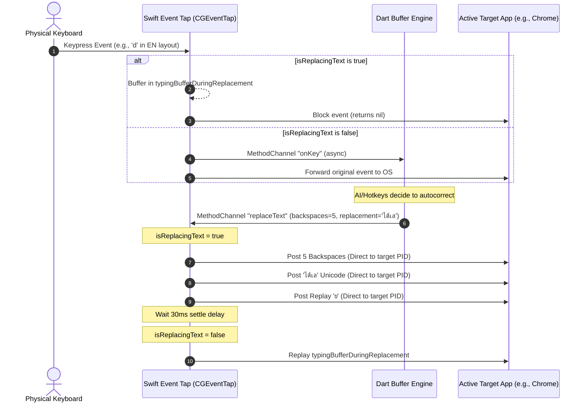

# TinyMind macOS Keyboard Engine Technical Documentation

This document explains the technical architecture, design decisions, and core concurrency/performance optimizations implemented in the TinyMind macOS keyboard engine. It is intended for developers maintaining or extending the project.

---

## 1. Architectural Overview

TinyMind is a hybrid application consisting of:
1. **Dart/Flutter Client (UI & AI Layer)**: Manages state, dictionary lookups, continuous spelling checks, and interacts with the AI model for bilingual layout decisions.
2. **Swift Native Runner (`AppDelegate.swift`)**: Intercepts physical keyboard inputs at the OS level using a low-level Event Tap (`CGEventTap`) and performs keyboard emulation.



---

## 2. Key Challenges & Core Implementations

### A. Thread Blocking & Event Tap Watchdog Timeouts
* **The Challenge**: macOS monitors low-level event tap callbacks very strictly. If a tap callback takes more than a few milliseconds (or blocks the main thread with synchronous IPC/system APIs), macOS watchdog will silently disable the event tap (dispatching a termination event of type `4294967295`).
* **The Culprit**: In early versions, checking the active keyboard layout called Carbon's synchronous TIS APIs (`isCurrentLayoutThai()`) inside the Event Tap callback.
* **The Solution**: 
  - **Asynchronous Layout Caching**: Introduced a local variable `cachedIsThai`. 
  - We listen to distributed and local system notifications (`kTISNotifySelectedKeyboardInputSourceChanged` and `keyboardSelectionDidChangeNotification`) to update the cache asynchronously *only* when the layout changes.
  - **Early Navigation Key Bypass**: Added a fast-path bypass for navigation and control keys (Tab, Esc, Arrows, PageUp/Down, Home, End) at the very top of `handleKeyEvent`. They bypass layout checks, Dart buffers, and return immediately, preventing unresponsiveness.

### B. Hardware Input Precedence & Character Scrambling (The Race Condition)
* **The Challenge**: Simulated keystrokes sent via `CGEvent` are processed asynchronously. Hardware events generated by the physical keyboard have kernel-level precedence.
* **The Race**: If a user continues typing physically during a correction sequence:
  1. Swift deletes the old text and types the replacement (`ได้เล`).
  2. Swift resets `isReplacingText = false`.
  3. Swift replays characters typed during the wait period (`ย`).
  4. Due to kernel precedence, the user's next physical keystroke can overtake the simulated events in the queue, rendering out-of-order text (e.g. `ยได้เล` instead of `ได้เลย`).
* **The Solution (Deferred Reset & Settle Delay)**:
  - **Protected Sequence**: `isReplacingText` remains `true` throughout the *entire* correction sequence, including typing the replacement characters *and* replaying the wait-period events. Any physical keypresses are safely intercepted and buffered.
  - **Direct PID-Targeted Posting**: Instead of posting simulated events globally using `CGEvent.post(tap: .cghidEventTap)`, we track the active application's Process ID (`activeAppPID`) and post events directly to its queue using `event.postToPid(pid)`. This bypasses WindowServer's session queue delays.
  - **Settle Delay**: A 30ms settle delay (`usleep(30000)`) is introduced *before* resetting `isReplacingText = false` to let the target application process the simulated keys before allowing physical keys.

### C. Self-Triggering Loops & Stable Enter Release
* **The Challenge**: When the user presses Enter, the app blocks it to evaluate autocorrect. If no correction is needed, the app must simulate an Enter press. However, simulating Enter triggers the Event Tap callback again, creating an infinite loop.
* **The Legacy Fix**: Disabling/enabling the tap via `CGEvent.tapEnable` was unstable and triggered watchdog timeouts because it blocked main thread loops.
* **The Solution (Magic Tagging)**:
  - We define a unique `Int64` constant `MAGIC_USER_DATA = 998877`.
  - When releasing Enter, we set the `.eventSourceUserData` field of the simulated event to this magic value.
  - The Event Tap checks this field on entry; if it matches, it allows it to pass through instantly without processing or calling Dart.

```swift
let source = CGEventSource(stateID: .privateState)
let down = CGEvent(keyboardEventSource: source, virtualKey: 0x24, keyDown: true)
down?.setIntegerValueField(.eventSourceUserData, value: MAGIC_USER_DATA)
// This event is ignored by handleKeyEvent's interception
```

### D. Multi-Language Backspace Breakdown (Grapheme Clusters)
* **The Challenge**: Deleting Thai characters is complex. Double-vowels (e.g., "ที่", "ยัง") are represented by multiple Unicode code points, but macOS and chromium-based text editors delete the entire grapheme cluster with a single Backspace keypress.
* **The Solution**: 
  - To prevent over-deletion (which would delete preceding spaces and merge words), the Dart engine computes the deletion count using `.characters.length` (Grapheme Cluster length) rather than the standard `.length` (Code Point length).
  - This ensures that 1 Backspace is sent per visible cluster, keeping typing buffer alignment clean.

---

## 3. Reference Configs & File Map

* **Event Tap Interceptor**: [AppDelegate.swift:L358-L577](file:///Users/q0022/sites/TinyMind/macos/Runner/AppDelegate.swift#L358-L577)
* **Text Replacement & Replay Logic**: [AppDelegate.swift:L585-L743](file:///Users/q0022/sites/TinyMind/macos/Runner/AppDelegate.swift#L585-L743)
* **Active Window/PID Tracker**: [AppDelegate.swift:L813-L822](file:///Users/q0022/sites/TinyMind/macos/Runner/AppDelegate.swift#L813-L822)
* **Autocorrect & Replay Sync (Dart)**: [main.dart:L1573-L1602](file:///Users/q0022/sites/TinyMind/lib/main.dart#L1573-L1602)
